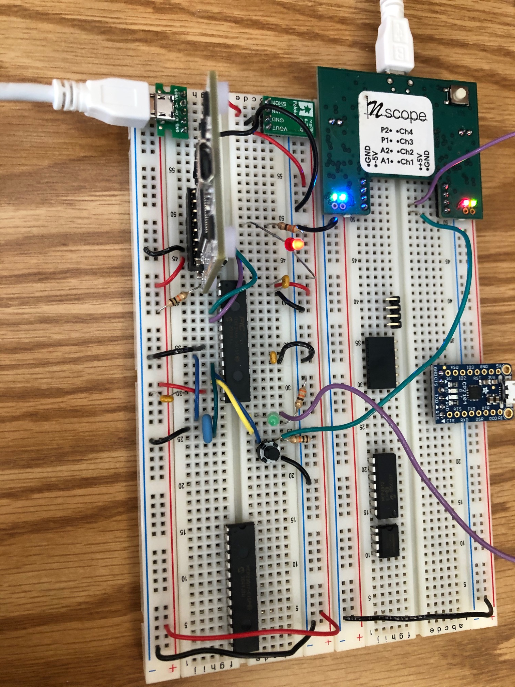

This is a basic circuit used to flash an LED:

<iframe src="https://giphy.com/embed/Magqa5wd2uVYdWm5QT" width="100%" height="100%" style="position:absolute" frameBorder="0" class="giphy-embed" allowFullScreen></iframe>

<a href="https://giphy.com/gifs/Magqa5wd2uVYdWm5QT">via GIPHY</a>

