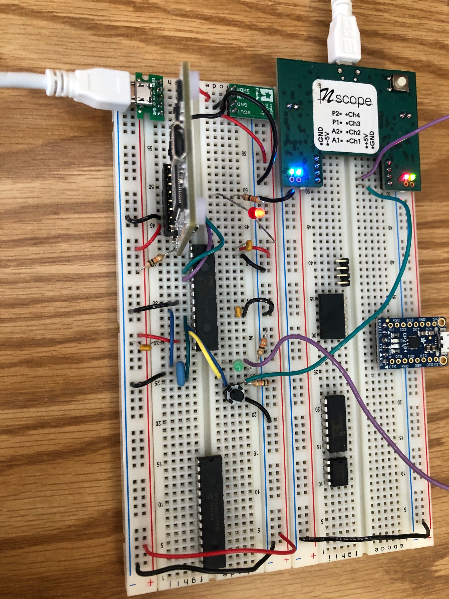

This is a basic circuit used to flash an LED:

<src="https://giphy.com/embed/Magqa5wd2uVYdWm5QT" width="270" height="480" frameBorder="0" class="giphy-embed" allowFullScreen></iframe>
<a href="https://giphy.com/gifs/Magqa5wd2uVYdWm5QT">via GIPHY</a>

