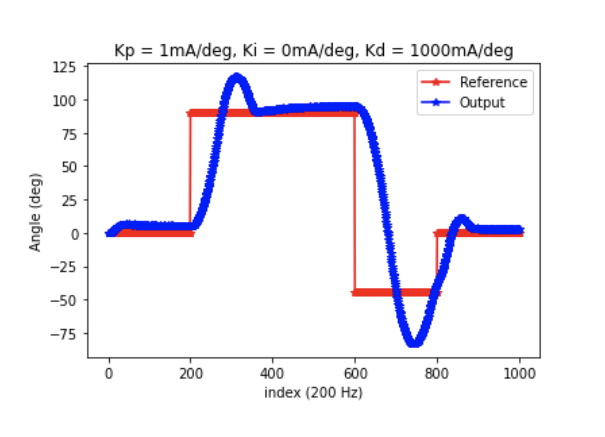
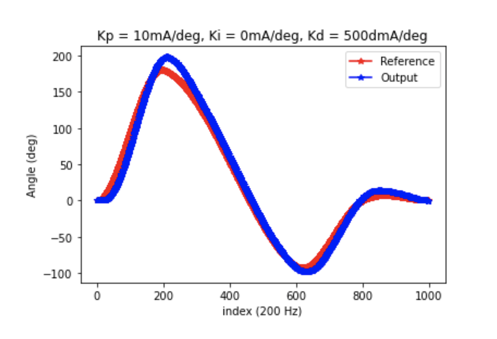

## Motor Control

This project was a closed-loop motor control project. The commanded trajectory position is converted to a torque/current command which is controlled with an inner PI control loop measuring current with a sensor.The angular position of the motor shaft is also controlled with an outer PID control loop using angular measurements from an encoder. Cubic and step trajectories were performed with the control scheme. The project is run through a user-controlled python program that allows the user to configure different modes, trajectories and actions to be performed by the motor. 

Demo of graphical display:

Cubic and Step trajectory performance:

