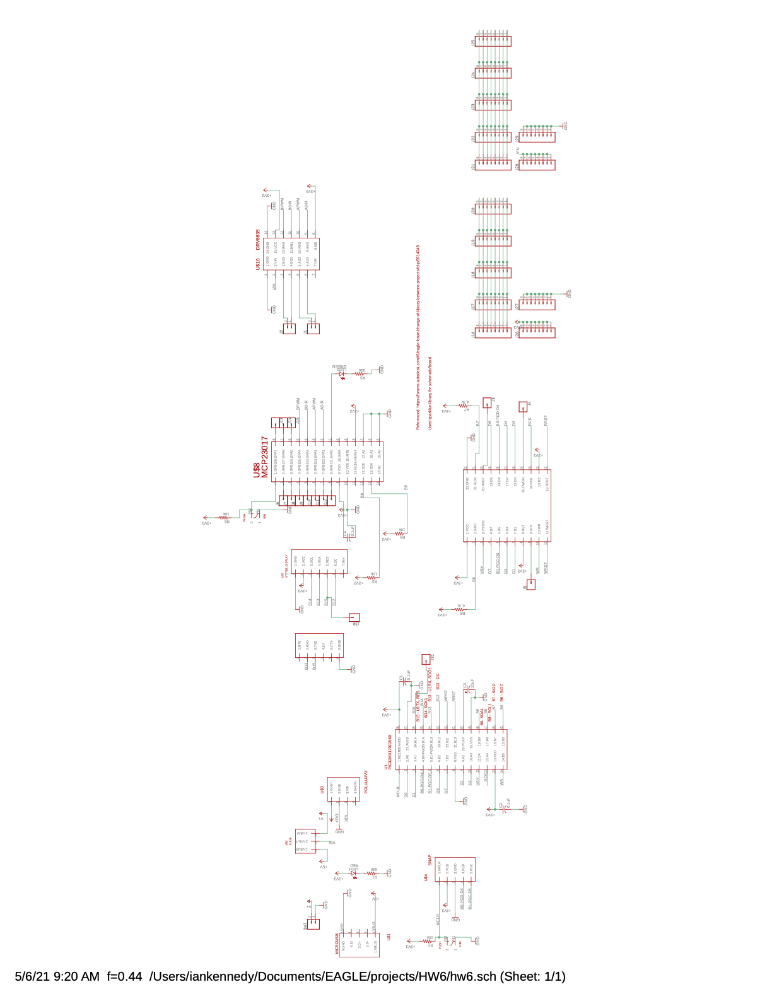
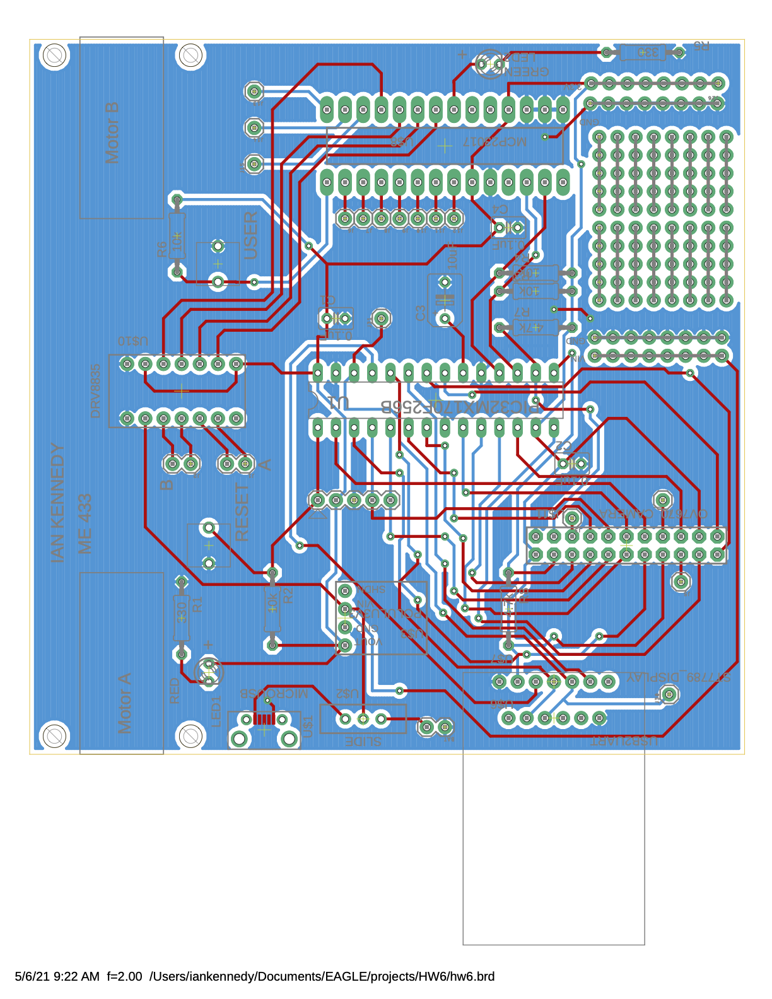

## PCB Design

This was a prototype board intended as a control circuit for a wheeled line-following robot. The PCB design was done in Eagle, and the board design was two-layer. 

Schematic:

Board Design:

